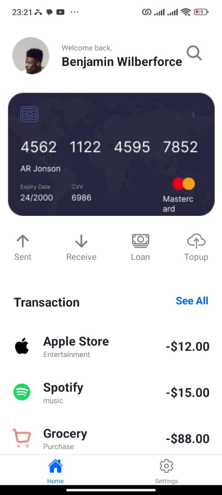
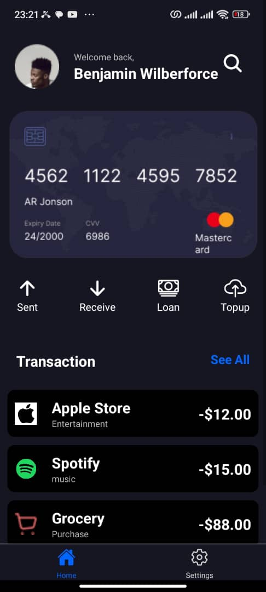
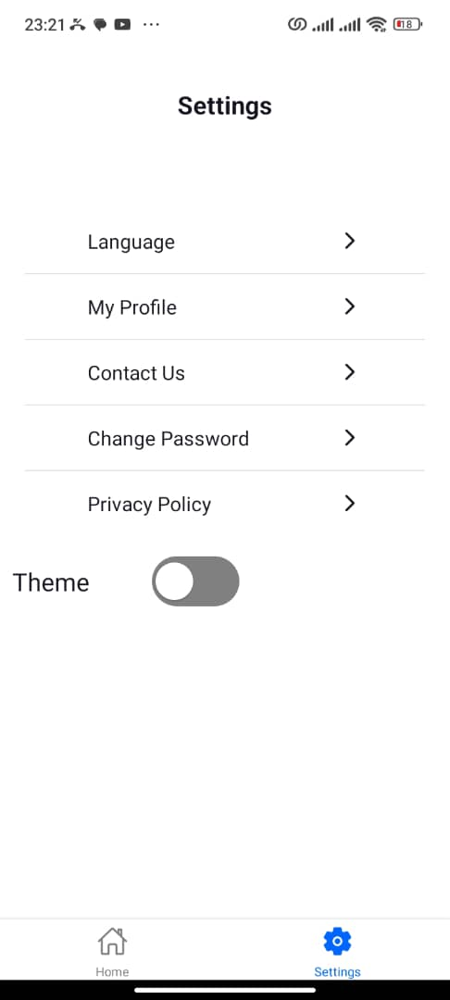
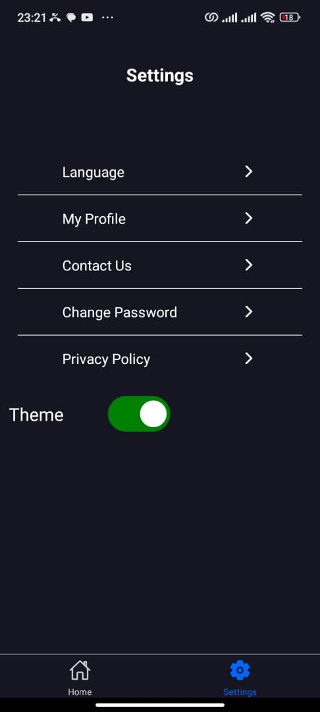

# Expo App README

## Description

This Expo app is a React Native application that showcases a simple home screen and settings screen, with support for dark mode. The app leverages the `react-native-vector-icons` library for icons, and uses context to manage the dark mode state across the app. It consists of the following main components:

1. **Home Screen**: Displays a welcome message, profile image, search icon, action icons (Send, Receive, Loan, Topup), and recent transactions.
2. **Settings Screen**: Provides navigation options to different settings pages (Language, Profile, Contact Us, Change Password, Privacy Policy) and a toggle switch for enabling/disabling dark mode.
3. **Dark Mode Feature**: Manages the dark mode state using a context provider, allowing other components to toggle and read the dark mode state.

## Features

- **Dark Mode**: Easily switch between light and dark themes using a toggle switch.
- **Navigation**: Navigate between different screens using React Navigation.
- **Custom Icons**: Utilize Ionicons for icons.
- **Reusable Components**: Modular components for actions and transactions for easy maintenance and reuse.

## Prerequisites

- Node.js and npm/yarn installed.
- Expo CLI installed (`npm install -g expo-cli`).

## Installation

1. Clone the repository:
   ```sh
   git clone https://github.com/yourusername/your-repo.git
   ```
2. Navigate to the project directory:
   ```sh
   cd your-repo
   ```
3. Install the dependencies:
   ```sh
   npm install
   # or
   yarn install
   ```
4. Start the Expo server:
   ```sh
   expo start
   ```

## Running the App

1. Start the Expo server (as shown in the installation steps).
2. Open the Expo Go app on your mobile device.
3. Scan the QR code generated by the Expo server to run the app on your device.

## Project Structure

- **`App.js`**: Entry point of the app. Sets up the dark mode provider and navigation container.
- **`components/DarkModeFeature.js`**: Manages dark mode state using React context.
- **`screens/Home.js`**: Home screen component displaying user information, action icons, and transaction history.
- **`screens/Settings.js`**: Settings screen component providing navigation to different settings and a toggle switch for dark mode.
- **`images/`**: Contains image assets used in the app.

## Screenshots

### Home Screen




### Settings Screen




## Styles

Styles are dynamically generated based on the dark mode state using the `getStyles` function in each screen component. This function takes a `darkMode` parameter and returns a `StyleSheet` object with appropriate styles for the current theme.

## License

This project is licensed under the MIT License - see the LICENSE file for details.

---

Feel free to customize this README to better fit your specific needs and project structure.